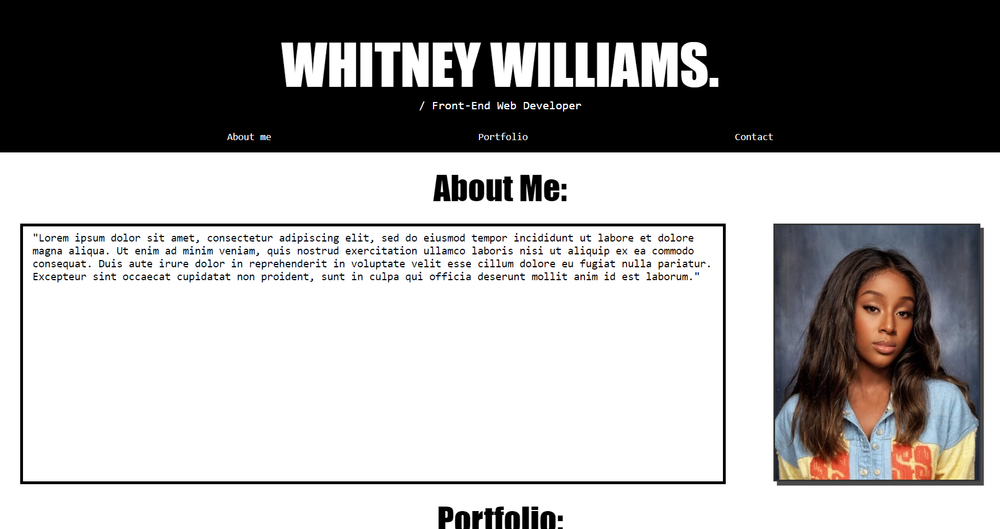

# Whitney Williams - Portfolio

## Description

Welcome to my portfolio page! 

As I gain more experience in the world of Front-End Development, this page will develop with me, showcasing all of the projects I come to work on. 

It will also offer the opportunity to get to know the person behind the code (aka me), and find out how you can get in touch. 

## About The Project

### [You can visit my portfolio page by clicking here.](https://whit-williams.github.io/ww-portfolio/)

### Project Status
This is a living project that will be regularly updated as I progress on the web development journey!

- Some project links are currently deadlinks pending the creation of additional projects
- The contact form is yet to go live, pending configuration with backend servers

### Technologies
This project is created with:

- Visual Studio Code 1.83.1
- Git Bash 5.2.15

### Key Features
- Navigation bar links to each section of web page
- About me and Contact sections use CSS Flexbox
- Portfolio section uses CSS Grid with featured project image larger than the others and clickable images that link to named project
- Media queries have been added in a seperate CSS style sheet, that create a responsive layout

### Credits
- How to create a HTML form https://www.w3schools.com/html/html_forms.asp
- Free placeholder images https://pixabay.com/
- How to add social media buttons https://www.w3schools.com/howto/howto_css_social_media_buttons.asp
- Adding media queries https://www.w3schools.com/cssref/css3_pr_mediaquery.php
- Page icons https://fontawesome.com/icons/envelope?f=classic&s=solid

### License 
None

